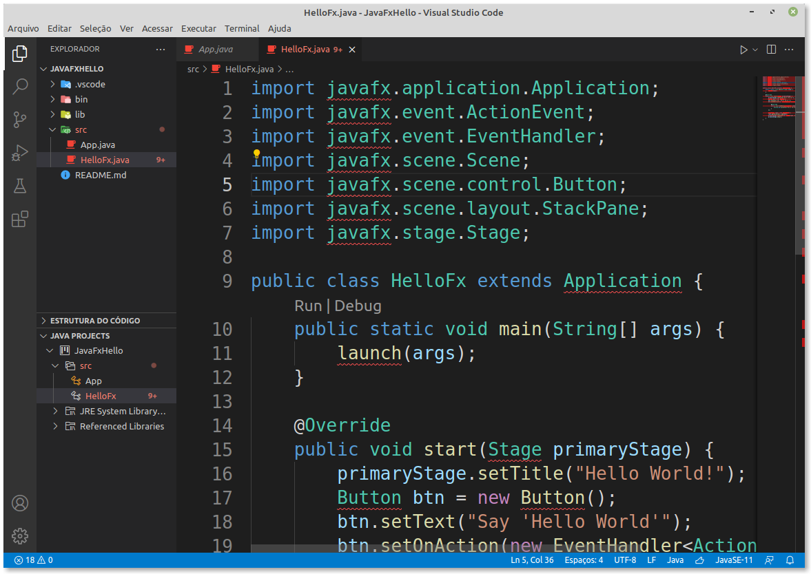

# Configurando o JavaFX no VSCode

## 01. Configurando o VSCode

- Instale a seguinte extensão no seu VSCode:
  - Java Extension Pack

## 02. Baixando o JavaFX
- Baixar biblioteca do JavaFX 17 em [gluonhq](https://gluonhq.com/products/javafx/).
- Baixe o arquivo **JavaFX SDK** certo para o seu SO.
    - Na página de downloads é possível selecionar o SO (Linux, Windows), a arquitetura e o tipo (SDK), como ilustrado na imagem abaixo.


- Após baixar, descompacte em alguma pasta e **anote** o path da pasta **lib**.
- No meu caso, como eu uso Linux, o path para pasta lib ficou como:
- `/home/fox/javafx/javafx-sdk-17.0.1/lib`


## 03. Criando o projeto

- Abra seu vscode
- Clique em na barra de Menu -> `View` -> `Command Palette`.
- Executar a opção `Java: Create Java Project`.
- Selecione `No build tools`.
- Selecione a pasta onde o projeto será criado.
- Selecione o nome do projeto, no meu caso: `JavaFxHello`.
- O vscode já monta o projeto e abre uma nova instância na pasta correta.

## 04. Configurando o projeto
- Abra o projeto criado.


- Abra o arquivo `src/App.java`
- Se o java estiver configurado corretamente, você deverá conseguir rodar o `App.java` clicando no `run`.


- Espere o vscode carregar o plugin "Java Projects".


- Vamos criar o arquivo `HelloFx.java` na mesma pasta que o arquivo `App.java` com o seguinte conteúdo.

```java
import javafx.application.Application;
import javafx.event.ActionEvent;
import javafx.event.EventHandler;
import javafx.scene.Scene;
import javafx.scene.control.Button;
import javafx.scene.layout.StackPane;
import javafx.stage.Stage;
 
public class HelloFx extends Application {
    public static void main(String[] args) {
        launch(args);
    }
    
    @Override
    public void start(Stage primaryStage) {
        primaryStage.setTitle("Hello World!");
        Button btn = new Button();
        btn.setText("Say 'Hello World'");
        btn.setOnAction(new EventHandler<ActionEvent>() {
 
            @Override
            public void handle(ActionEvent event) {
                System.out.println("Hello World!");
            }
        });
        
        StackPane root = new StackPane();
        root.getChildren().add(btn);
        primaryStage.setScene(new Scene(root, 300, 250));
        primaryStage.show();
    }
}
```
- Todos os imports de javafx estão em vermelho, o que significa que o vscode não sabe onde encontrar esses pacotes.



- Clique em `JAVA PROJECTS` no canto inferior esquerdo e em `+` que fica ao lado de `Referenced Libraries` e selecione os arquivos .jar que estão na pasta onde colocamos o javafx.


- Isso deverá criar um arquivo `.vscode/settings.json` referenciando todos os .jar que você adicionou.


- Com isso, o vscode já sabe onde achar o javafx e você poderá conferir imports do código não aparecerão mais em vermelho e o autocomplete funciona corretamente.


## 05. Executando
- Se tentar executar pelo botão `run`, terá **AINDA** a seguinte mensagem: 


- Isso acontece porque a execução de um projeto javafx exige que os módulos sejam passado por parâmetro para o comando `java`.

- Crie e salve o arquivo `.vscode/launch.json`.


- Clique em `Add Configuration...` -> `Java: Launch Program`


- Salve o arquivo e dê o `run` novamente no `HelloFx.java`. Ainda vai dar errado, mas irá criar automaticamente uma entrada **personalizada para o HelloFx** no arquivo `launch.json`.

- Adicione a seguinte entrada `vmArgs` nessa entrada **substituindo** CAMINHO_DO_JAVAFX_LIB pelo caminho onde está sua pasta `lib` que pegamos no passo 02.

```
"vmArgs": "--module-path CAMINHO_DO_JAVAFX_LIB --add-modules javafx.controls,javafx.base,javafx.fxml,javafx.graphics,javafx.media,javafx.web",
```


- Se estiver no Windows, você deve colocar a partição e usar \\\\ para separar as pastas. Evite espaços em branco no path. Por exemplo, seu path seria algo como:
```
C:\\Users\\lucas\\Documents\\javafxsdk17.0.1\\lib
```
- Se seu path tiver espaços em branco você precisará escrever assim tanto no Windows como no Linux:
```
\"C:\\Users\\lucas\\Area de trabalho\\javafx sdk11.0.2\\lib\"
```

- Agora salve e execute:


