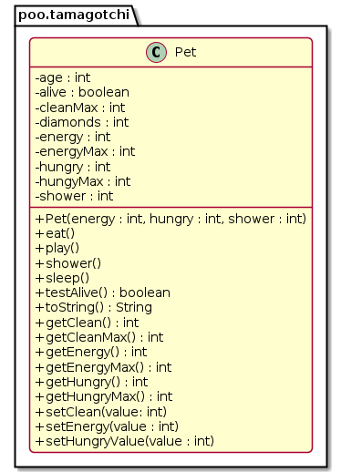

# Tamagotchi  (modificadores de acesso, gets, sets)


<!--TOC_BEGIN-->
- [Requisitos](#requisitos)
- [Shell](#shell)
    - [Exemplo 1](#exemplo-1)
    - [Exemplo 2](#exemplo-2)
    - [Exemplo 3](#exemplo-3)
- [Diagrama](#diagrama)
- [Esqueleto](#esqueleto)
<!--TOC_END-->


Você deve implementar um simulador de bichinho virtual. Ele poderá comer, brincar, dormir e tomar banho. E eventualmente morrerá, se você não cuidar bem dele.

O projeto deve conter pelo menos duas classes. A classe Tamagotchi e a class Jogo.

***

## Requisitos
Seu sistema deverá:

- **Inicializar**
    - passando energia, saciedade e limpeza máximas do pet.
    - Todos os níveis devem ser iniciados no máximo na criação do pet.
    - Os outros atributos são 
        - diamantes, que ele vai ganhar jogando.
        - e idade que aumenta a cada ação realizada, 
        - ambos iniciando em 0.
- **Comendo, Jogando, Dormindo e tomando banho**
    - Cada operação causa aumento e reduções nos atributos.
    - Nenhum atributo pode passar do máximo ou ir abaixo de 0.
- **Morrendo**
    - Se algum atributo chegar a 0, o pet morre e nenhuma ação pode ser feita a não ser mostrar os dados.

***

## Shell
### Exemplo 1

```bash
#__case inicio
# O comando "$init energia saciedade limpeza" recebe os valores do pet.
# O pet inicia com 0 diamantes e 0 de idade.
# Toda vez que $init é chamado, um novo pet é criado.
$init 20 10 15
# O comando "$show" mostra os parâmetros do Pet na seguinte ordem
# Energia/Max, Saciedade/Max, Limpeza/Max, Diamantes, Idade
$show
E:20/20, S:10/10, L:15/15, D:0, I:0
$init 10 20 50
$show
E:10/10, S:20/20, L:50/50, D:0, I:0
$end
```

```bash
#__case play - Brincar 
# O comando "$play" altera em -2 energia, -1 saciedade, -3 limpeza, +1 diamante, +1 idade.
$init 20 10 15
$play
$show
E:18/20, S:9/10, L:12/15, D:1, I:1
$play
$show
E:16/20, S:8/10, L:9/15, D:2, I:2

#__case comer 
# O Comando "$eat" altera em -1 a energia, +4 a saciedade, -2 a limpeza, +0 diamantes,  +1 a idade
$eat
$show
E:15/20, S:10/10, L:7/15, D:2, I:3

#__case dormir
# O Comando "$sleep" aumenta energia até o máximo e idade aumenta do número de turnos que o pet dormiu.
# Os outros atributos permanecem inalterados.
$sleep
$show
E:20/20, S:9/10, L:7/15, D:2, I:8

#__case tomar banho
# O comando "$clean" alteram em -3 energia, -1 na saciedade, MAX na limpeza, +0 diamantes, +2 na idade.
$clean
$show
E:17/20, S:8/10, L:15/15, D:2, I:10

#__case dormir sem sono
# Para dormir, precisa ter perdido pelo menos 5 unidades de energia
$sleep
fail: nao esta com sono

#__case morrer
# Se algum atributo atingir 0, o pet morre e não poderá executar nenhuma ação
$play
$play
$play
$play
$show
E:9/20, S:4/10, L:3/15, D:6, I:14
$play
fail: pet morreu de sujeira
$show
E:7/20, S:3/10, L:0/15, D:7, I:15
$play
fail: pet esta morto
$eat
fail: pet esta morto
$clean
fail: pet esta morto
$sleep
fail: pet esta morto
$end
```

### Exemplo 2
```bash
#__case exemplo2
$init 5 10 10
$play
$play
$play
fail: pet morreu de fraqueza
$play
fail: pet esta morto
$show
E:0/5, S:7/10, L:1/10, D:3, I:3
$end
```

### Exemplo 3
```bash
#__case exemplo3
$init 10 3 10
$play
$play
$play
fail: pet morreu de fome
$play
fail: pet esta morto
$show
E:4/10, S:0/3, L:1/10, D:3, I:3
$end
```

***
## Diagrama
Os métodos get e set estão marcados de △ apenas para facilitar a visualização, mas podem ser tratados como métodos públicos.



***
## Esqueleto
```java
<!--FILTER Solver.java java-->
```java
class Pet{
    private int energyMax, hungryMax, cleanMax;
    private int energy, hungry, shower;
    private int diamonds;
    private int age;
    private boolean alive;
    // Atribui o valor de energia
    // Se o valor ficar abaixo de 0, o pet morre de fraqueza
    // Garanta que os valores ficarão no interalo 0 - max
    // Use esse modelo para fazer os outros métodos set
    void setEnergy(int value){
        if(value <= 0){
            this.energy = 0;
            System.out.println("fail: pet morreu de fraqueza");
            this.alive = false;
        }
        else if(value > this.energyMax)
            this.energy = this.energyMax;
        else
            this.energy = value;
    }
    void setHungry(int value);
    void setClean(int value);
    public Pet(int energy, int hungry, int shower);
    int getClean();
    int getHungry();
    int getEnergy();
    int getEnergyMax();
    int getCleanMax();
    int getHungryMax();
    public String toString();
    public boolean testAlive();
    // Invoca o método testAlive para verificar se o pet esta vivo
    // Se estiver vivo, altere os atributos utilizando os métodos set e get
    public void play();
    public void shower();
    public void eat();
    public void sleep();
}
class Solver{
    public static void main(String[] args) {
        Scanner scanner = new Scanner(System.in);
        Pet pet = new Pet(0, 0, 0);
        while(true) {
            String line = scanner.nextLine();
            System.out.println("$" + line);
            String ui[] = line.split(" ");
            if(ui[0].equals("end")) {
                break;
            } else if(ui[0].equals("show")) {
                System.out.println(pet.toString());
            } else if(ui[0].equals("init")) {
                int energy = Integer.parseInt(ui[1]);
                int hungry = Integer.parseInt(ui[2]);
                int shower = Integer.parseInt(ui[3]);
                pet = new Pet(energy, hungry, shower);
            } else if(ui[0].equals("play")) {
                pet.play();
            } else if(ui[0].equals("eat")) {
                pet.eat();
            } else if(ui[0].equals("shower")) {
                pet.shower();
            } else if(ui[0].equals("sleep")) {
                pet.sleep();
            } else {
                System.out.println("fail: comando invalido");
            }
        }
        scanner.close();
    }
}

class Manual {
    public static void main(String[] args) {
        //case inicio
        Pet pet = new Pet(20, 10, 15);
        System.out.print(pet);
        //E:20/20, S:10/10, L:15/15, D:0, I:0
        pet = new Pet(10, 20, 50);
        System.out.print(pet);
        //E:10/10, S:20/20, L:50/50, D:0, I:0

        //case play - Brincar 
        pet = new Pet(20, 10, 15);
        pet.play();
        System.out.print(pet);
        //E:18/20, S:9/10, L:12/15, D:1, I:1
        pet.play();
        System.out.print(pet);
        //E:16/20, S:8/10, L:9/15, D:2, I:2

        //case comer 
        pet.eat();
        System.out.print(pet);
        //E:15/20, S:10/10, L:7/15, D:2, I:3

        //case dormir
        pet.sleep();
        System.out.print(pet);
        //E:20/20, S:9/10, L:7/15, D:2, I:8

        //case tomar banho
        pet.shower();
        System.out.print(pet);
        //E:17/20, S:8/10, L:15/15, D:2, I:10

        //case dormir sem sono
        pet.sleep();
        //fail: nao esta com sono

        //case morrer
        pet.play();
        pet.play();
        pet.play();
        pet.play();
        System.out.print(pet);
        //E:9/20, S:4/10, L:3/15, D:6, I:14
        pet.play();
        //fail: pet morreu de sujeira
        System.out.print(pet);
        //E:7/20, S:3/10, L:0/15, D:7, I:15
        pet.play();
        //fail: pet esta morto
        pet.eat();
        //fail: pet esta morto
        pet.shower();
        //fail: pet esta morto
        pet.sleep();
        //fail: pet esta morto

        //case exemplo2
        pet = new Pet(5, 10, 10);
        pet.play();
        pet.play();
        pet.play();
        //fail: pet morreu de fraqueza
        pet.play();
        //fail: pet esta morto
        System.out.print(pet);
        //E:0/5, S:7/10, L:1/10, D:3, I:3

        //case exemplo3
        pet = new Pet(10, 3, 10);
        pet.play();
        pet.play();
        pet.play();
        //fail: pet morreu de fome
        pet.play();
        //fail: pet esta morto
        System.out.print(pet);
        //E:4/10, S:0/3, L:1/10, D:3, I:3
    }
}
```
<!--FILTER_END-->