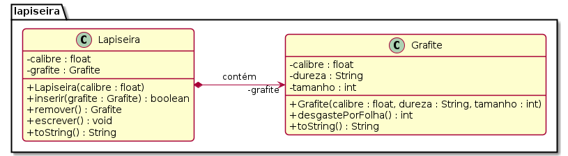

# Lapiseira e Grafite


Implemente o modelo de uma lapiseira que pode conter um único grafite.

## Requisitos
- Iniciar lapiseira
    - Inicia uma lapiseira de determinado calibre sem grafite.
- Inserir grafite
    - Insere um grafite passando
        - o calibre: float.
        - a dureza: string.
        - o tamanho em mm: int.
    - Não deve aceitar um grafite de calibre não compatível.
- Remover grafite
    - Retira o grafite se houver algum.
- Escrever folha
    - Não é possível escrever se não há grafite.
    - Quanto mais macio o grafite, mais rapidamente ele se acaba. Para simplificar, use a seguinte regra:
        - Grafite HB: 1mm por folha.
        - Grafite 2B: 2mm por folha.
        - Grafite 4B: 4mm por folha.
        - Grafite 6B: 6mm por folha.
        
    - O último centímetro de um grafite não pode ser aproveitado, quando o grafite estiver com 10mm, não é mais possível escrever e o grafite deve ser retirado.
    - Se não houver grafite suficiente para terminar a folha, avise que o texto ficou incompleto.
    - Avise quando o grafite acabar.


## Shell

```bash
#__case inserindo grafites
$init 0.5
$show
calibre: 0.5, grafite: null
$add 0.7 2B 50
fail: calibre incompatível
$add 0.5 2B 50
$show
calibre: 0.5, grafite: [0.5:2B:50]
$end
```

```bash
#__case inserindo e removendo
$init 0.3
$add 0.3 2B 50
$show
calibre: 0.3, grafite: [0.3:2B:50]
$add 0.3 4B 70
fail: ja existe grafite
$show
calibre: 0.3, grafite: [0.3:2B:50]
$remove
$add 0.3 4B 70
$show
calibre: 0.3, grafite: [0.3:4B:70]
$end
```

```bash
#__case escrevendo 1
$init 0.9
$add 0.9 4B 14
$write
warning: grafite acabou
$show
calibre: 0.9, grafite: [0.9:4B:10]
$remove
$show
calibre: 0.9, grafite: null
$add 0.9 4B 16
$write
$show
calibre: 0.9, grafite: [0.9:4B:12]
$write
fail: folha incompleta
warning: grafite acabou
$show
calibre: 0.9, grafite: [0.9:4B:10]
$end
```


## Diagrama



Salve o seu trabalho em uma pasta chamada **lapiseira** e envie pelo Moodle.

***
## Esqueleto

Logo abaixo, você encontra um esqueleto da atividade.

<!--FILTER Solver.java java-->
```java
class Grafite {
    float calibre;
    String dureza;
    int tamanho;
    Grafite(float calibre, String dureza, int tamanho);
    String toString();
    int desgastePorFolha();
}
class Lapiseira {
    float calibre;
    Grafite grafite;
    Lapiseira(float calibre);
    String toString();
    boolean inserir(Grafite grafite);
    Grafite remover();
    void escreverFolha();
}
class Solver{
    public static void main(String[] args) {
        Locale.setDefault(Locale.US);
        Scanner scanner = new Scanner(System.in);
        Lapiseira lapiseira = new Lapiseira(0.5f);
        while(true) {
            String line = scanner.nextLine();
            System.out.println("$" + line);
            String ui[] = line.split(" ");
            if(ui[0].equals("end")) {
                break;
            } else if(ui[0].equals("help")) {
                System.out.println("init _calibre; add _calibre _dureza _tamanho; remove; write _folhas");
            } else if(ui[0].equals("init")) { //calibre
                lapiseira = new Lapiseira(Float.parseFloat(ui[1]));
            } else if(ui[0].equals("add")) { //calibre dureza tamanho
                float calibre = Float.parseFloat(ui[1]);
                String dureza  = ui[2];
                int tamanho = Integer.parseInt(ui[3]);
                lapiseira.inserir(new Grafite(calibre, dureza, tamanho));
            } else if(ui[0].equals("remove")) {
                lapiseira.remover();
            } else if(ui[0].equals("show")) {
                System.out.println(lapiseira);
            } else if (ui[0].equals("write")) {
                lapiseira.escreverFolha();
            } else {
                System.out.println("fail: comando invalido");
            }
        }
        scanner.close();
    }
}

class Manual {
    public static void main(String[] args) {
        //case inserindo grafites
        Lapiseira lapiseira = new Lapiseira(0.5f);
        System.out.println(lapiseira);
        //calibre: 0.5, grafite: null
        lapiseira.inserir(new Grafite(0.7f, "2B", 50));
        //fail: calibre incompatível
        lapiseira.inserir(new Grafite(0.5f, "2B", 50));
        System.out.println(lapiseira);
        //calibre: 0.5, grafite: [0.5:2B:50]

        //case inserindo e removendo
        lapiseira = new Lapiseira(0.3f);
        lapiseira.inserir(new Grafite(0.3f, "2B", 50));
        System.out.println(lapiseira);
        //calibre: 0.3, grafite: [0.3:2B:50]
        lapiseira.inserir(new Grafite(0.3f, "4B", 70));
        //fail: ja existe grafite
        System.out.println(lapiseira);
        //calibre: 0.3, grafite: [0.3:2B:50]
        lapiseira.remover();
        lapiseira.inserir(new Grafite(0.3f, "4B", 70));
        System.out.println(lapiseira);
        //calibre: 0.3, grafite: [0.3:4B:70]

        //case escrevendo 1
        lapiseira = new Lapiseira(0.9f);
        lapiseira.inserir(new Grafite(0.9f, "4B", 4));
        lapiseira.escreverFolha();
        //warning: grafite acabou
        System.out.println(lapiseira);
        //calibre: 0.9, grafite: null
        lapiseira.inserir(new Grafite(0.9f, "4B", 30));
        lapiseira.escreverFolha();
        System.out.println(lapiseira);
        //calibre: 0.9, grafite: [0.9:4B:6]
        lapiseira.escreverFolha();
        lapiseira.escreverFolha();
        lapiseira.escreverFolha();
        //fail: folhas escritas completas: 1
        //warning: grafite acabou
        System.out.println(lapiseira);
        //calibre: 0.9, grafite: null

        //case escrevendo 2
        lapiseira = new Lapiseira(0.9f);
        lapiseira.inserir(new Grafite(0.9f, "2B", 15));
        System.out.println(lapiseira);
        //calibre: 0.9, grafite: [0.9:2B:15]
        lapiseira.escreverFolha();
        lapiseira.escreverFolha();
        lapiseira.escreverFolha();
        lapiseira.escreverFolha();
        System.out.println(lapiseira);
        //calibre: 0.9, grafite: [0.9:2B:7]
        lapiseira.escreverFolha();
        lapiseira.escreverFolha();
        lapiseira.escreverFolha();
        lapiseira.escreverFolha();
        //fail: folhas escritas completas: 3
        //warning: grafite acabou
        System.out.println(lapiseira);
        //calibre: 0.9, grafite: null
    }
}
```
<!--FILTER_END-->
