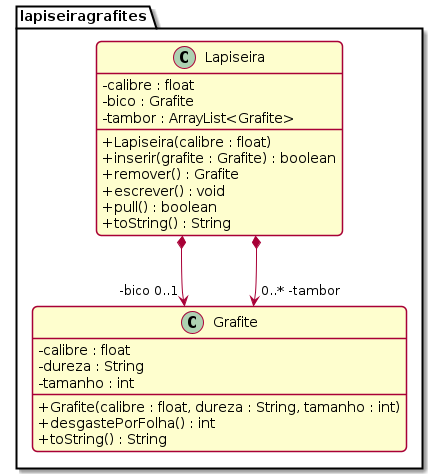

# Lapiseira com vários Grafites


Implemente o modelo de uma lapiseira que pode conter vários grafites.

## Requisitos
- Iniciar lapiseira
    - Inicia uma lapiseira de determinado calibre sem grafite.
    - Lapiseiras possuem um bico e um tambor.
    - O bico guarda o grafite que está em uso. 
    - O tambor guarda os grafites reservas.
- Inserir grafite
    - Insere um grafite passando:
        - o calibre: float.
        - a dureza: string.
        - o tamanho em mm: int.
    - Não deve aceitar um grafite de calibre não compatível.
    - O grafite é colocado como o ÚLTIMO grafite do tambor.
- Puxar grafite
    - Puxa o grafite do tambor para o bico.
    - Se já tiver um grafite no bico, esse precisa ser removido primeiro.
- Remover grafite
    - Retira o grafite do bico.
- Escrever folha
    - Não é possível escrever se não há grafite no bico.
    - Quanto mais macio o grafite, mais rapidamente ele se acaba. Para simplificar, use a seguinte regra:
        - Grafite HB: 1mm por folha.
        - Grafite 2B: 2mm por folha.
        - Grafite 4B: 4mm por folha.
        - Grafite 6B: 6mm por folha.
        
    - Os últimos 10 milímetros de um grafite não podem ser aproveitados. Quando o grafite estiver com 10mm, não é mais possível escrever e o grafite deve ser retirado.
    - Se não houver grafite suficiente para terminar a folha, avise que o texto ficou incompleto.
    - Avise quando o grafite acabar.


## Shell

```bash
#__case inserindo grafites
$init 0.5
$show
calibre: 0.5, bico: [], tambor: {}
$add 0.7 2B 50
fail: calibre incompatível
$add 0.5 2B 50
$show
calibre: 0.5, bico: [], tambor: {[0.5:2B:50]}
$add 0.5 2B 30
$show
calibre: 0.5, bico: [], tambor: {[0.5:2B:50][0.5:2B:30]}
$pull
$show
calibre: 0.5, bico: [0.5:2B:50], tambor: {[0.5:2B:30]}
$pull
fail: ja existe grafite no bico
$remove
$show
calibre: 0.5, bico: [], tambor: {[0.5:2B:30]}
$end
```


```bash
#__case escrevendo 1
$init 0.9
$add 0.9 4B 14
$add 0.9 4B 16
$write
fail: nao existe grafite no bico
$pull
$show
calibre: 0.9, bico: [0.9:4B:14], tambor: {[0.9:4B:16]}
$write
warning: grafite acabou
$show
calibre: 0.9, bico: [0.9:4B:10], tambor: {[0.9:4B:16]}
$remove
$pull
$show
calibre: 0.9, bico: [0.9:4B:16], tambor: {}
$write
$show
calibre: 0.9, bico: [0.9:4B:12], tambor: {}
$write
fail: folha incompleta
warning: grafite acabou
$show
calibre: 0.9, bico: [0.9:4B:10], tambor: {}
$write
fail: grafite acabou
$remove
$show
calibre: 0.9, bico: [], tambor: {}
$pull
fail: nao existe grafite no tambor
$end
```


## Diagrama



Salve o seu trabalho em uma pasta chamada **lapiseiragrafites** e envie pelo Moodle

***
## Esqueleto

<!--FILTER Solver.java java-->
```java
class Grafite {
    float calibre;
    String dureza;
    int tamanho;
    Grafite(float calibre, String dureza, int tamanho);
    String toString();
    int desgastePorFolha();
}
class Lapiseira {
    float calibre;
    Grafite bico;
    ArrayList<Grafite> tambor;
    Lapiseira(float calibre);
    String toString();
    boolean inserir(Grafite grafite);
    Grafite remover();
    boolean puxar();
    void escrever();
}
class Solver{
    public static void main(String[] args) {
        Scanner scanner = new Scanner(System.in);
        Lapiseira lapiseira = new Lapiseira(0.5f);
        while(true) {
            String line = scanner.nextLine();
            System.out.println("$" + line);
            String ui[] = line.split(" ");
            if(ui[0].equals("end")) {
                break;
            } else if(ui[0].equals("help")) {
                System.out.println("init _calibre; add _calibre _dureza _tamanho; remove; pull; write _folhas");
            } else if(ui[0].equals("init")) { //calibre
                lapiseira = new Lapiseira(Float.parseFloat(ui[1]));
            } else if(ui[0].equals("add")) {//calibre dureza tamanho
                float calibre = Float.parseFloat(ui[1]);
                String dureza  = ui[2];
                int tamanho = Integer.parseInt(ui[3]);
                lapiseira.inserir(new Grafite(calibre, dureza, tamanho));
            } else if(ui[0].equals("remove")) {
                lapiseira.remover();
            } else if(ui[0].equals("show")) {
                System.out.println(lapiseira);
            } else if (ui[0].equals("write")) {
                lapiseira.escrever();
            } else if (ui[0].equals("pull")) {
                lapiseira.puxar();
            }  else {
                System.out.println("fail: comando invalido");
            }
        }
        scanner.close();
    }
}
```
<!--FILTER_END-->
