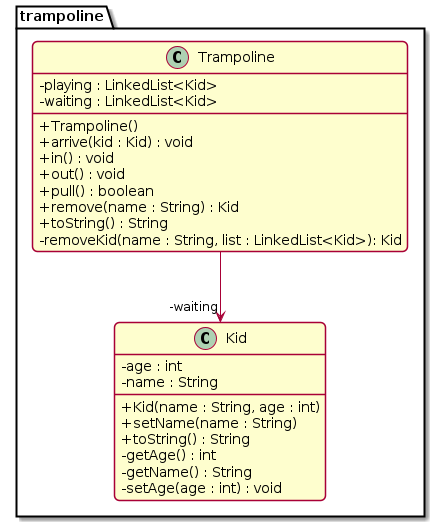

# Pula pula no parquinho (Manipulação de LinkedList)


Nosso objetivo no trabalho é modelar um gestor de pula-pulas em um parquinho.

## Requisitos
- Inserir crianças na fila de espera do pula pula
- Mover a primeira criança da fila de espera do pula-pula para dentro do pula-pula.
- Mover a primeira criança que entrou no pula pula-para o final da fila de espera.
- Você deve usar a estrutura de dados **LinkedList** do Java nesta atividade. Pesquise sobre esta estrutura. Para acessar uma descrição completa da classe, acesse a API do Java: https://docs.oracle.com/en/java/javase/16/docs/api/java.base/java/util/LinkedList.html


## Shell
```bash
#__case unico
# $chegou _nome _idade
# insere uma criança na fila de entrada do brinquedo
$arrive mario 5
$arrive livia 4
$arrive luana 3

# show
# mostra a fila de entrada e o pula pula
$show
=> luana:3 livia:4 mario:5 => [ ]

#__case entrando
# entrar
# tira a primeira criança da fila de entrada e insere no pula pula

$in
$show
=> luana:3 livia:4 => [ mario:5 ]
$in
$show
=> luana:3 => [ livia:4 mario:5 ]

#__case saindo
$out
$show
=> mario:5 luana:3 => [ livia:4 ]

#__case remove
$remove luana
$show
=> mario:5 => [ livia:4 ]
$remove livia
$show
=> mario:5 => [ ]
$end
```

## Opcional
```sh
$saldo _nome
$caixa
# Cada vez que a criança anda no pula pula e sai, a conta dela aumenta 
# e quando ela vai embora, ela dá dinheiro aumentando o dinheiro do pula pula.
# 'saldo' mostra o valor que uma criança deve acumulado.
# 'caixa' mostra quanto dinheiro o pula pula já arrecadou.
$papaichegou _nome
# O pai dele chegou, então você busca a criança seja da fila de entrada 
# ou de dentro do pula pula e retira do brinquedo.
$fechar
# retira todas as criancas do pula pula e da fila
$init _max
# você pode definir no construtor o máximo de crinças que cabe ou o 
# limite de idade suportada.
$entrar
# você pode alterar o método entrar para não misturar crianças grandes 
# com crianças pequenas dentro do pula pula. Ao chamar entrar, você procura 
# a criança mais nova que está no pula pula, por exemplo 2 anos. 
# Então o comando entrar vai procurar na fila de espera a primeira criança 
# com idade compatível, por exemplo, até 4 anos(2 + 2). Se a primeira 
# criança da fila de espera tem 5 anos, olha a segunda, se essa tem 3 anos, 
# então coloca a segunda criança no pula pula.
```


***
## Diagrama

***
## Esqueleto
<!--FILTER Solver.java java-->
```java
class Kid {
    private int age;
    private String name;
    public Kid(String name, int age);
    int getAge();
    String getName();
    void setAge(int age);
    public void setName(String name); //gs
    public String toString();
}
class Trampoline{
    private LinkedList<Kid> waiting;
    private LinkedList<Kid> playing;
    public Trampoline();
    //remove and return the Kid with this name or null
    private Kid remove_kid(String name, LinkedList<Kid> list);
    //insere na lista de espera
    public void arrive(Kid kid);
    //remove da lista de espera e insere na lista playing
    public void in();
    //remove de playing para wainting
    public void out();
    //remove do parquinho
    public Kid remove(String name);
    public String toString();
}
class Solver {
    public static void main(String[] args) {
        Scanner scanner = new Scanner(System.in);
        Trampoline tramp = new Trampoline();
        while(true) {
            String line = scanner.nextLine();
            System.out.println("$"+ line);
            String[] ui = line.split(" ");
            if(ui[0].equals("end")) {
                break;
            } else if(ui[0].equals("arrive")) { // name age
                tramp.arrive(new Kid(ui[1], Integer.parseInt(ui[2]))) ;
            } else if(ui[0].equals("in")) {
                tramp.in();
            } else if(ui[0].equals("out")) {
                tramp.out();
            } else if(ui[0].equals("remove")) {//name
                tramp.remove(ui[1]);
            } else if(ui[0].equals("show")) {
                System.out.println(tramp);
            } else {
                System.out.println("fail: comando invalido");
            }
        }
        scanner.close();
    }
}

class Manual {
    public static void main(String[] args) {
        
        //case unico
        Trampoline trampoline = new Trampoline();
        trampoline.arrive(new Kid("mario", 5));
        trampoline.arrive(new Kid("livia", 4));
        trampoline.arrive(new Kid("luana", 3));
        System.out.println(trampoline);
        //=> luana:3 livia:4 mario:5 => [ ]

        //case entrando
        trampoline.in();
        System.out.println(trampoline);
        //=> luana:3 livia:4 => [ mario:5 ]
        trampoline.in();
        System.out.println(trampoline);
        //=> luana:3 => [ livia:4 mario:5 ]

        //case saindo
        trampoline.out();
        System.out.println(trampoline);
        //=> mario:5 luana:3 => [ livia:4 ]
    }
}
```
<!--FILTER_END-->