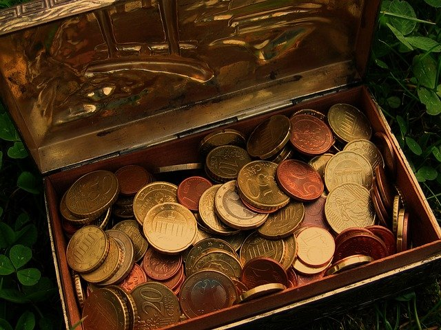
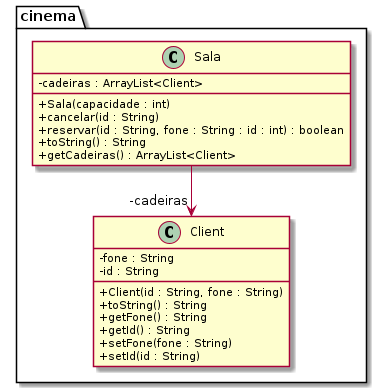

# Cofre



## Descrição
O sistema deverá:

- Gerenciar um cofrinho do tipo Porquinho capaz de guardar moedas e itens.
- As moedas devem ser criadas através de uma `enum`.
- O item tem uma descrição.
- Ambos moedas e itens tem um atributo volume.
- O volume do cofre incrementa conforme ele recebe itens e moedas.
- A lógica da utilização do cofre é:
    - Para inserir moedas e itens o cofre deve estar inteiro.
    - Para obter moedas e itens o cofre deve estar quebrado.
    - Ao obter moedas e itens, os atribuitos `valor` e `itens` do porco devem ser zerados.

## Diagrama


## Esqueleto
<!--FILTER Solver.java java-->
```java
enum Moeda {
    M10(0.10, 1),
    M25(0.25, 2),
    M50(0.50, 3),
    M100(1.00, 4);

    public double valor;
    public int volume;
    private Moeda(double valor, int volume) {
        this.valor = valor;
        this.volume = volume;
    }
    public String toString() {
        return "Valor: " + valor + " Volume: " + valor;
    }
}

class Item {
    public String descricao;
    public int volume;
    public Item(String descricao, int volume);
    public String toString();
}
class Porco{
    public String itens = "";
    public double valor = 0;
    public int volume = 0;
    public int volumeMax;
    public boolean estaQuebrado = false;
    //inicializa o volumeMax
    public Porco(int volumeMax);
    //se nao estiver quebrado e couber, adicione o valor e o volume
    public boolean addMoeda(Moeda moeda);
    //se não estiver quebrado e couber, adicione no volume e na descrição
    public boolean addItem(Item item);
    //quebre o porco
    public boolean quebrar();
    //se estiver quebrado, pegue e retorne o valor
    public double pegarMoedas();
    //se estiver quebrado, pegue e retorno os itens
    public String pegarItens();
    //mostre o conteúdo do porco
    public String toString();
}
public class Solver{
    public static void main(String[] args) {
        Porco porco = new Porco(20);
        System.out.println(porco); //I:() M:0 V:0/20 EQ:false
        porco.addMoeda(Moeda.M10);
        porco.addMoeda(Moeda.M50);
        System.out.println(porco); //I:() M:60 V:4/20 EQ:false

        porco.addItem(new Item("ouro", 3));
        System.out.println(porco); //I:(ouro) M:60 V:7/20 EQ:false

        porco.addItem(new Item("passaporte", 2));
        System.out.println(porco); //I:(ouro, passaporte) M:60 V:9/20 EQ:false

        porco.pegarItens();  //Voce deve quebrar o cofre primeiro
        porco.pegarMoedas(); //Voce deve quebrar o cofre primeiro
        System.out.println(porco); //I:(ouro, passaporte) M:60 V:9/20 EQ:false

        porco.quebrar();
        porco.quebrar();

        System.out.println(porco.pegarItens());  //ouro, passaporte
        System.out.println(porco.pegarMoedas()); //60.0
        System.out.println(porco); //I:() M:0 V:9/20 EQ:true
    }
}
```
<!--FILTER_END-->