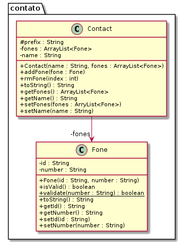

# Topic de Luxo 


O objetivo dessa atividade é exercitar o que vocês aprenderam no cinema com algumas variações. Aqui, vamos implementar um sistema de alocação de passageiros em uma topic. Nossa topic tem uma quantidade máxima de passageiros, mas também define alguns assentos preferenciais.

***
## Requisitos
Seu sistema deverá:

- **[3.0 P] Inicializar e Mostrar.** 
    - Iniciar a topic solicitando a lotação máxima e a quantidade de cadeiras preferenciais.
    - Mostrar o estado do trem
        - Coloque @ na frente das cadeiras preferenciais
        - Coloque = na frente das cadeiras normais.
- **[5.0 P] Inserir.** 
    - Inserir passageiros informando id e idade
        - Se o passageiro for idoso:
            - Se houver cadeiras preferenciais
                - Coloque-o na primeira cadeira preferencial.
            - Senão
                - O coloque na primeira cadeira normal.
        - Se o passageiro não for idoso.
            - Se houver cadeiras não preferenciais
                - Coloque-o na primeira cadeira não preferencial.
            - Se não
                - Coloque-o na primeira cadeira preferencial.
- **[2.0 P] Remover.** 
    - Remover passageiros por id

Existe uma lista para as cadeiras normais e outra para as preferenciais. Para facilitar nas operações de busca e inserção, você deverá criar vários métodos privados para simplificar a lógica dos métodos principais.

***
## Shell

```bash

#######################################
#__case Inicializar
#######################################
# init _lotacao _qtd_prioritarios
$show
[]
$init 5 2
$show
[@ @ = = =]

#######################################
#__case Embarque
#######################################

$in davi 17
$show
[@ @ =davi:17 = =]
$in joao 103
$show
[@joao:103 @ =davi:17 = =]
$in ana 35
$show
[@joao:103 @ =davi:17 =ana:35 =]
$in rex 20
$in bia 16
$show
[@joao:103 @bia:16 =davi:17 =ana:35 =rex:20]

#######################################
#__case Desembarque
#######################################

$out davi
$show
[@joao:103 @bia:16 = =ana:35 =rex:20]
$in aragao 96
$show
[@joao:103 @bia:16 =aragao:96 =ana:35 =rex:20]

#######################################
#__case Erros
#######################################

$in lucas 23
fail: topic lotada
$out marcelo
fail: pass nao esta na topic
$out ana
$in bia 13
fail: pass ja esta na topic
$show
[@joao:103 @bia:16 =aragao:96 = =rex:20]
$end
#__end__
```

***
## Diagrama



## Esqueleto
<!--FILTER Solver.java java-->
```java
class Pass {
    private String name;
    private int age;
    public Pass(String name, int age);
    //return true if pass.age >= 65
    public boolean isPriority();
    //GETS e SETS
    String getName();
    void setName(String name);
    int getAge();
    void setAge(int age);
    public String toString();
}
class Topic {
    private ArrayList<Pass> prioritySeats;
    private ArrayList<Pass> normalSeats;
    public Topic(int capacity, int qtdPriority);
    //return the first free pos or -1
    private int findFirstFreePos(ArrayList<Pass> list);
    //search in list using name and return position or return -1
    private int findByName(String name, ArrayList<Pass> list);
    //use the findFirstFreePos to search a free position
    //if exists, insert the pass and return true
    //else return false
    private boolean insertOnList(Pass pass, ArrayList<Pass> list);
    //use the findByName method to locate pos in list, if found, remore the person
    //setting the pos location to null
    private boolean removeFromList(String name, ArrayList<Pass> list);
    //use findByName to test if the pass is already in the topic
    //use the insertOnList method to insert in the right list based in
    //the pass.isPriority result
    public boolean insert(Pass pass);
    //use the removeFromList method to try to remove from both lists
    public boolean remove(String name);
    public String toString();
}
class Solver{
    public static void main(String[] args) {
        Scanner scanner = new Scanner(System.in);
        Topic topic = new Topic(0, 0);
        while(true){
            String line = scanner.nextLine();
            System.out.println("$" + line);
            String ui[] = line.split(" ");
            if(line.equals("end")) {
                break;
            } else if(ui[0].equals("init")) { //capacity qtdPriority
                topic = new Topic(Integer.parseInt(ui[1]), Integer.parseInt(ui[2]));
            } else if(ui[0].equals("show")) {
                System.out.println(topic);
            } else if(ui[0].equals("in")) {
                topic.insert(new Pass(ui[1], Integer.parseInt(ui[2])));
            } else if(ui[0].equals("out")) {//value value
                topic.remove(ui[1]);
            } else {
                System.out.println("fail: comando invalido");
            }
        }
        scanner.close();
    }
}
```
<!--FILTER_END-->