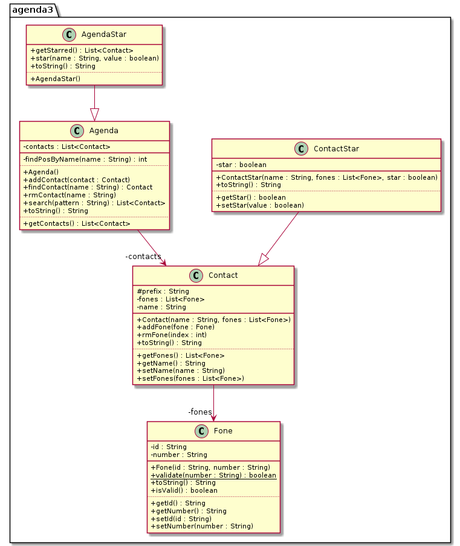

# Contato Star - Agenda 3 (herança)


Ampliando a atividade de agenda 2, vamos criar uma agenda que gerencia os nossos contatos.


## Requisitos

O sistema deverá:
- Partida
    - Você deve utilizar o código construído na atividade busca. Você deve partir do código do projeto Busca e NÃO DEVE MODIFICAR em nada as classes originais.
    - Você deve criar uma classe **ContatoStar** que herda de *Contato* e adiciona a ação de favoritar.
        - Para isso o novo contato ganhará um atributo `star` que marca se ele está favoritado.
    - Você deve criar uma classe **AgendaStar** que herda de *Agenda* e adiciona a ação de favoritar e pegar favoritos.
        - A nova agenda ganhará os métodos `star` e `getStarred` para favoritar e pegar os favoritos.
- Mostrando
    - Ordenar os contatos pelo idContato.
    - Se o contato não for favorito (starred) use - antes do idContato.
    - Marque os contatos que são favoritados com um @ antes do idContato. 

- Favoritando
    - Favoritar contatos. (star)
    - Desfavoritar contatos. (unstar)
    - Mostrar apenas os favoritos. (starred)
    
- Sua **AgendaStar** deve ser capaz de manipular tanto contatos normais quanto ContactStar, mas só deve ser capaz de favoritar ContactStar

## Shell

```bash
#__case iniciando agenda
$add eva oi:8585 claro:9999
$add ana tim:3434 
$add ana casa:4567 oi:8754
$add bia vivo:5454
$add rui casa:3233
$add zac fixo:3131

$show
- ana [0:tim:3434] [1:casa:4567] [2:oi:8754]
- bia [0:vivo:5454]
- eva [0:oi:8585] [1:claro:9999]
- rui [0:casa:3233]
- zac [0:fixo:3131]

#__case favoritando
$star eva
$star ana
$star ana
$star zac
$star rex
fail: contato rex nao existe

$show
@ ana [0:tim:3434] [1:casa:4567] [2:oi:8754]
- bia [0:vivo:5454]
@ eva [0:oi:8585] [1:claro:9999]
- rui [0:casa:3233]
@ zac [0:fixo:3131]

#__case lista de favoritos
$starred
@ ana [0:tim:3434] [1:casa:4567] [2:oi:8754]
@ eva [0:oi:8585] [1:claro:9999]
@ zac [0:fixo:3131]

#__case removendo contato
$rmContact zac

$show
@ ana [0:tim:3434] [1:casa:4567] [2:oi:8754]
- bia [0:vivo:5454]
@ eva [0:oi:8585] [1:claro:9999]
- rui [0:casa:3233]

$starred
@ ana [0:tim:3434] [1:casa:4567] [2:oi:8754]
@ eva [0:oi:8585] [1:claro:9999]

#__case desfavoritando
$unstar ana

$starred
@ eva [0:oi:8585] [1:claro:9999]

$show
- ana [0:tim:3434] [1:casa:4567] [2:oi:8754]
- bia [0:vivo:5454]
@ eva [0:oi:8585] [1:claro:9999]
- rui [0:casa:3233]
$end
```

***
## Diagrama UML


## Esqueleto
<!--FILTER Solver.java java-->
```java
public class Fone {
    private String id;
    private String number;
    public Fone(String id, String number);
    //verifica se o número é um número de telefone válido
    public static boolean validate(String number);
    //O resultado deve ficar assim
    //oi:1234
    public String toString();
    //GETS e SETS
    public String getId();
    public void setId(String id);
    public String getNumber();
    public void setNumber(String number);
    //utiliza o static validate para retornar se essa instancia do fone é valida
    public boolean isValid();
}
class Contact {
    private String name;
    private List<Fone> fones;
    protected String prefix = "-"; //utilizado no toString
    //Crie um ArrayList para o ATRIBUTO fones
    //Se a variável fones não for null, adicione todos os fones usando o método addFone
    public Contact(String name, List<Fone> fones);
    //Se fone for válido, insira no atributo fones
    //Se não, informe o erro
    public void addFone(Fone fone);
    //Se o índice existir no ArrayList, remova o telefone com esse índice
    public void rmFone(int index);
    //Use um contador para mostrar o índice do telefone
    //Use o toString do fone para adicioná-lo à saída
    //O resultado dever ficar assim:
    //- david [0:oi:123] [1:tim:9081] [2:claro:5431]
    public String toString();
    //GETS e SETS
    public String getName();
    public void setName(String name);
    public List<Fone> getFones();
    //limpe a lista de fones
    //utilize o addFone para adicionar apenas os fones válidos
    public void setFones(List<Fone> fones);
}
class Agenda {
    private List<Contact> contacts;
    public Agenda();
    //retorna a posição do contato com esse nome no vetor ou -1 se não existir.
    private int findPosByName(String name);
    //retorna o objeto contato com esse nome ou null se não existir
    //utilize o método findPosByName
    public Contact findContact(String name);
    //se nenhum contato existir com esse nome, adicione
    //se ja existir, faça o merge adicionando os telefones
    public void addContact(Contact contact);
    //Utilize o método findPos
    public void rmContact(String name);
    //Monte uma lista auxiliar procurando no .toString() de cada contato
    //se ele possui a substring procurada.
    public List<Contact> search(String pattern);
    public List<Contact> getContacts();
    public String toString();
}
class ContactStar extends Contact {
    private boolean star;
    //contrutor default
    public ContactStar(String name, List<Fone> fones, boolean star);
    //muda o prefixo e o valor de star
    void setStar(boolean value);
    boolean getStar(); 
}
class AgendaStar extends Agenda {
    //SE o contato existir e for do tipo ContatoStar altere o atributo star dele
    public void star(String name, boolean value); 
    //filtre em uma nova lista apenas os contatos que forem do tipo ContatoStar e que estão favoritados
    public List<Contact> getStarred();
}
class Solver {
    //cria um ContactStar a partir do vetor de entrada tal como
    //add joao oi:123 tim:432 claro:09123
    static ContactStar parseContact(String[] ui) {
        return new ContactStar(ui[1], Arrays.asList(ui).stream()
            .skip(2).map(token -> new Fone(token.split(":")[0], token.split(":")[1]))
            .collect(Collectors.toList()), false);
    }
    //Lembre de criar uma AgendaStar no lugar de uma agenda normal e adicionar a ela contatos Star
    public static void main(String[] args) {
        Scanner scanner = new Scanner(System.in);
        AgendaStar agenda = new AgendaStar();
        while(true) {
            String line = scanner.nextLine();
            System.out.println("$" + line);
            String ui[] = line.split(" ");
            
            if(ui[0].equals("end")) {
                break;
            } else if(ui[0].equals("init")) {
                agenda = new AgendaStar();
            } else if(ui[0].equals("add")) { //name label:fone label:fone label:fone
                agenda.addContact(Solver.parseContact(ui));
            } else if(ui[0].equals("rm")) { //name
                agenda.rmContact(ui[1]);;
            } else if(ui[0].equals("rmFone")) { //name index
                agenda.findContact(ui[1]).rmFone(Integer.parseInt(ui[2]));
            } else if(ui[0].equals("show")) {
                System.out.println(agenda);
            } else if(ui[0].equals("star")) {
                agenda.star(ui[1], true);
            } else if(ui[0].equals("unstar")) {
                agenda.star(ui[1], false);
            } else if(ui[0].equals("starred")) {
                System.out.println(agenda.getStarred().stream().map(c -> "" + c).collect(Collectors.joining("\n")));
            } else if(ui[0].equals("search")) {
                System.out.println(agenda.search(ui[1]).stream().map(c -> "" + c).collect(Collectors.joining("\n")));
            } else {
                System.out.println("fail: invalid command");
            }
        }
        scanner.close();
    }
}
```
<!--FILTER_END-->